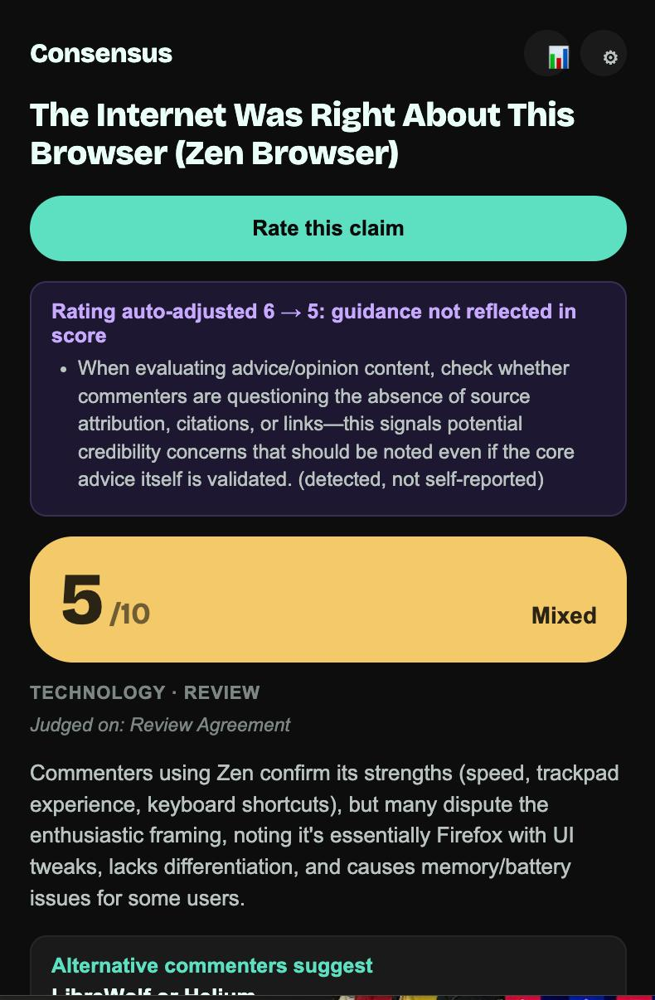

# Consensus

Rates whether a YouTube video title's claimed outcome holds up, based on viewer comments.

This extension reads the comments so you don't have to sit through 12 minutes to find out that you dont agree with the video. It srapes the comments from DOM, runs it against a set of no-nonsense rules, and arrives at a score that tells you straight up if this is worth your time, or skip it.

**Live on the Chrome Web Store. Install from the official site** · [consensuss.lol](https://consensuss.lol)

## How it works

1. On a YouTube `/watch` page, a badge appears next to the video title.
2. Click it (or use the toolbar popup) to scroll through and scrape the comments directly from the page DOM — no
   YouTube Data API, no Google Cloud key or quota needed.
3. The title + comments are sent to your chosen LLM provider (OpenAI,
   Anthropic, or Gemini) using an API key you supply.
4. The model returns:
   - a **1-10 rating** and a **verdict** (Confirmed / Mixed / Debunked / etc.)
   - a plain-language summary with supporting/contradicting points
   - a **Disputed** flag when support and contradiction are both
     substantial, so a genuinely split audience isn't averaged into a
     falsely confident middle score
   - a separate **authenticity flag** for corroborated concerns (staged
     content, bought engagement) without letting that override the
     claim rating on its own

Note : Comment ranking merges near-duplicate/echo replies into a single point of
evidence, and enforces a minimum-sample floor (fewer than 6 usable
comments forces "Insufficient Evidence") — both borrowed from how Reddit
(Wilson score confidence, Controversial-sort polarization) and Steam
(review-count gating) handle consensus at scale.

## Setup

Install the packaged version from the
  [Chrome Web Store](https://chromewebstore.google.com/detail/objmiejnkplkblidmamkfinfpkmnkjnb?utm_source=item-share-cb).
  

## Privacy & security

Full detail on the
  [public Security page](https://consensuss.lol/security/).
  

## Carrying Learned Guidance to another device

The dashboard's **Learned Guidance** panel holds rules distilled from
your corrections (via "Redo w/ note"), applied to every future analysis.
It lives in `chrome.storage.local`, so it's local to one browser by
default:

- **Export / Import (any time):** on the dashboard, "Export Guidance"
  downloads the current rule set as JSON; "Import Guidance" on another
  device merges it in, skipping near-duplicate rules automatically.
- **Bundled seed (new installs):** overwrite `guidance-seed.json` with an
  exported guidance JSON before loading the extension to give every
  fresh install that baseline applied once, only if that device's
  guidance store is empty.
  

## Limitations to note

- Comment scraping reads whatever YouTube has rendered in the DOM after
  auto-scrolling; sparsely-commented or comments-disabled videos yield
  little signal.
- Ratings are only as good as the comment sample and the LLM's judgment,
  so treat this as a leading indicator, not a fact-check.
- YouTube's DOM structure changes periodically; if the badge or comment
  scraping stops working, check the selectors in `content.js`
  (`getTitle`, `findTitleAnchor`, `scrapeVisibleComments`) first.
  

## Links

- Website: [consensuss.lol](https://consensuss.lol)
- FAQ: [consensuss.lol/faq](https://consensuss.lol/faq/)
- Security: [consensuss.lol/security](https://consensuss.lol/security/)
- Privacy Policy: [consensuss.lol/privacy](https://consensuss.lol/privacy/)
